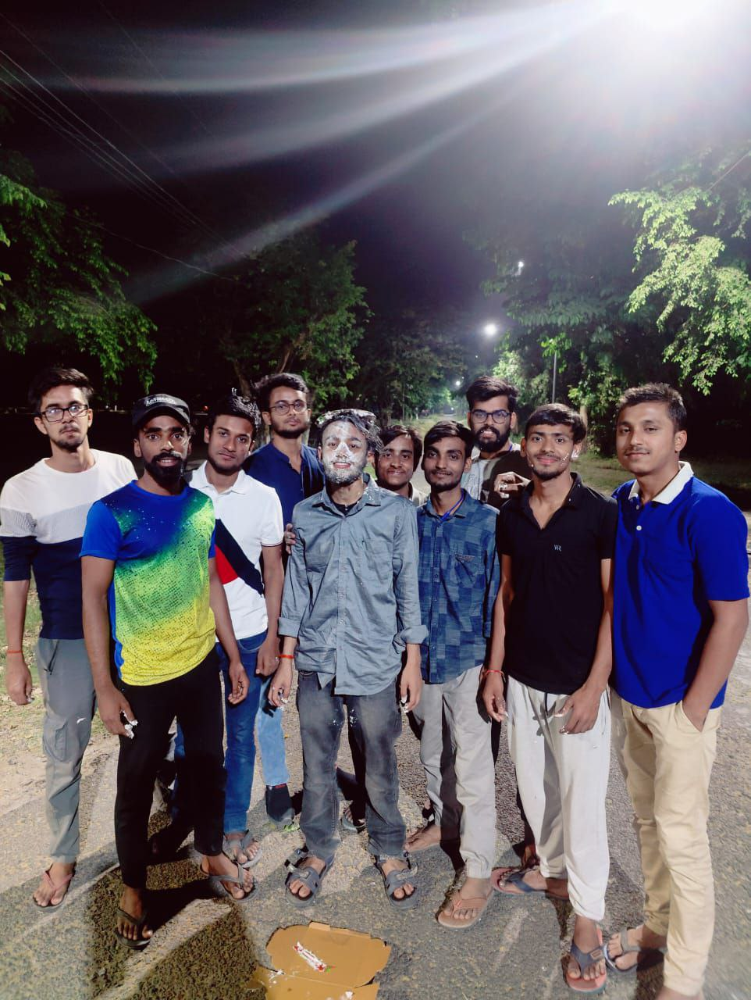
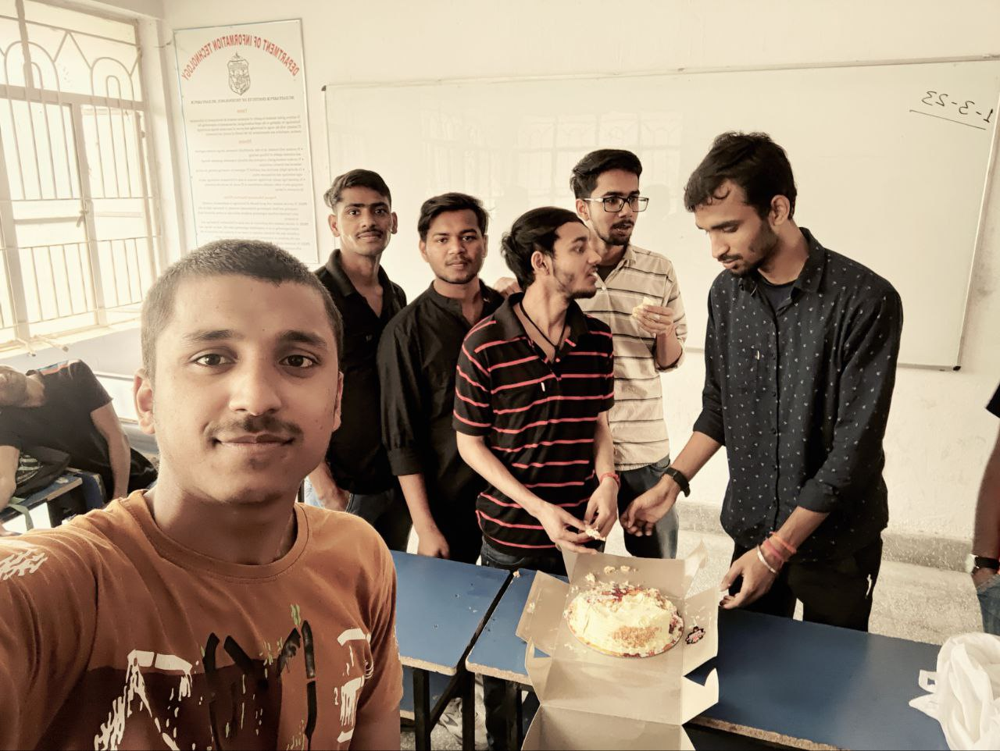

#Bithday
<!DOCTYPE html>
<html>
<head>
  <title>Happy Birthday!</title>
 
</head>
<body>
    
 " Friendship is a house that is built on and sustained by love. "  

    
        

    
    

                
        
        
    

  <h1>Happy Birthday,<a href="https://www.google.com/search?q=hacker+img&tbm=isch&ved=2ahUKEwiAh5Lgpv3-AhWFqGMGHUTpAhkQ2-cCegQIABAA&oq=hacker&gs_lcp=CgNpbWcQARgAMgcIABCKBRBDMgoIABCKBRCxAxBDMgoIABCKBRCxAxBDMgoIABCKBRCxAxBDMgoIABCKBRCxAxBDMgoIABCKBRCxAxBDMgoIABCKBRCxAxBDMgoIABCKBRCxAxBDMgcIABCKBRBDMggIABCABBCxAzoECCMQJzoFCAAQgAQ6CwgAEIAEELEDEIMBUP4SWNUaYJMoaABwAHgAgAHmBIgBswuSAQcwLjYuNS0xmAEAoAEBqgELZ3dzLXdpei1pbWfAAQE&sclient=img&ei=4EdlZICXK4XRjuMPxNKLyAE&bih=533&biw=1266#imgrc=AOoa-DRBVXN6IM"> [Kartik:The Coder and ...]!</a></h1>
  
"Happy birthday to my incredible best friend Kartik! May your day be filled with love, laughter, and unforgettable moments."

  <canvas id="confetti"></canvas>
  
  
</body>
</html>
